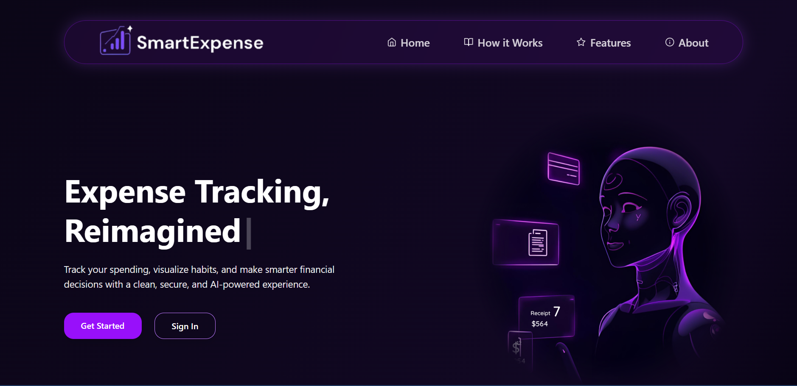
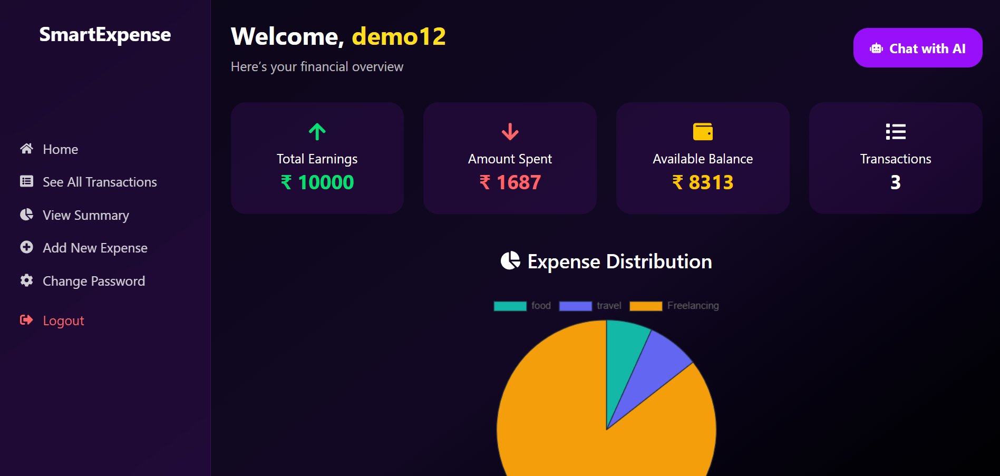
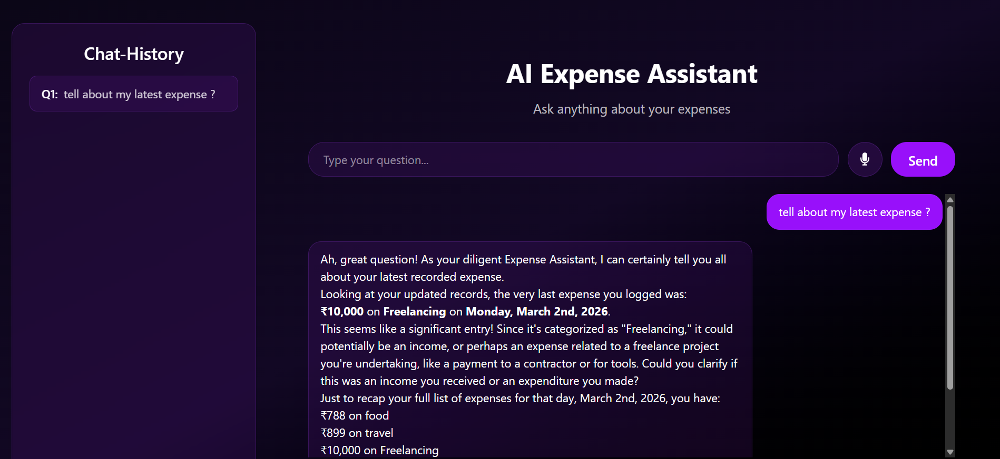

# 💰 Smart Expense Tracker Website

A **personalized, AI-powered expense tracker** designed to make managing your finances simple, interactive, and intelligent.  
Built with the **MERN stack (MongoDB, Express, React, Node.js)**, this platform goes beyond traditional trackers by integrating modern AI features and secure authentication.

---

## 📸 Project Screenshots

### 🔐 Authentication Page

### 📊 Interactive Dashboard

### 🤖 AI Chatbot & Voice Feature

---

## ✨ Key Features

- 🤖 **AI-Powered Chatbot**: Interact with your expense tracker through a friendly chatbot. Ask about your spending, get suggestions, or query specific expenses using natural language.  
- 🎤 **Voice Query Support**: Use your voice to add or inquire about expenses, making the app hands-free and accessible.  
- 📄 **Expense Summary Download (PDF)**: Generate detailed expense reports and download them as PDF files for easy record-keeping.  
- 🔒 **JWT Authentication**: Secure login/signup using JSON Web Tokens to protect your personal data.  
- 📊 **Interactive Dashboard**: Visualize your spending habits with charts and categorized summaries.  
- ➕ **CRUD Operations**: Add, edit, and delete expenses effortlessly.  
- 📱 **Responsive UI**: Works seamlessly on both desktop and mobile devices.  

---

## 🛠️ Tech Stack

- **Frontend:** React.js, HTML, CSS, JavaScript  
- **Backend:** Node.js, Express.js  
- **Database:** MongoDB (Mongoose ORM)  
- **Authentication:** JWT (JSON Web Token)  
- **AI & Voice:** Integrated chatbot using AI API + Web Speech API  

---

## 🚀 Why This Project?

This is more than just an expense tracker — it's a **smart financial assistant**. Whether you want to query your expenses using voice, chat naturally with the AI, or download detailed PDF reports, this platform gives a **personalized and interactive experience** to manage your finances efficiently.

